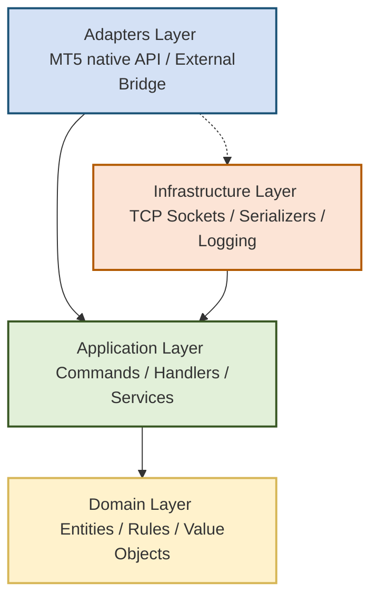
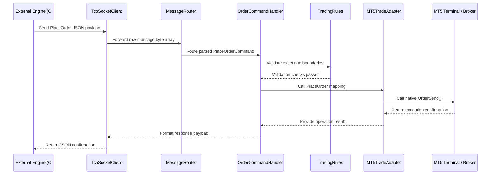
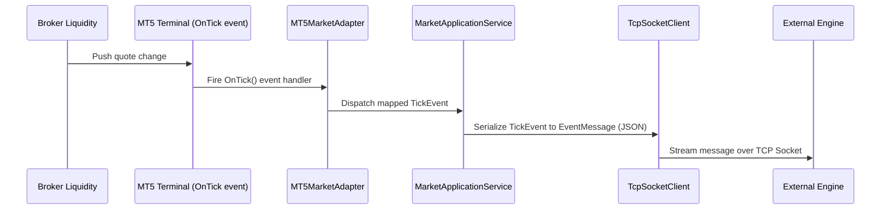

# NexusBridge MT5

## Clean Architecture Trading Bridge for MetaTrader 5

NexusBridge is an MQ5-based integration framework designed to decouple MetaTrader 5 execution and data streams from core trading logic. By positioning MT5 purely as an execution adapter, NexusBridge allows developers to host their primary trading logic, AI decision engines, risk managers, or machine learning models in external environments (such as C#, C++, Python, or cloud-based microservices).

---

## Directory Structure

```text
MQL5/
└── Experts/
    └── Nexus/
        ├── NexusBridge.mq5              # EA Entry Point
        │
        ├── Core/                        # System Initialization & Shared Globals
        │   ├── Bootstrap.mqh            # System bootstrapper
        │   ├── DependencyContainer.mqh  # IoC/DI container
        │   ├── Constants.mqh            # Global system-wide constants
        │   ├── Exceptions.mqh           # Error and exception definitions
        │   └── Version.mqh              # System version definition
        │
        ├── Domain/                      # Pure Business Logic (No MT5 dependencies)
        │   ├── Entities/                # Domain models with identity
        │   │   ├── OrderEntity.mqh
        │   │   ├── PositionEntity.mqh
        │   │   ├── AccountEntity.mqh
        │   │   └── SymbolEntity.mqh
        │   ├── ValueObjects/            # Immutable domain values
        │   │   ├── Price.mqh
        │   │   ├── Volume.mqh
        │   │   └── RiskAmount.mqh
        │   ├── Interfaces/              # Abstract contracts
        │   │   ├── IOrderService.mqh
        │   │   ├── IMarketService.mqh
        │   │   ├── IAccountService.mqh
        │   │   └── IMessageBus.mqh
        │   └── Rules/                   # Pure business validation logic
        │       ├── RiskRules.mqh
        │       └── TradingRules.mqh
        │
        ├── Application/                 # Use Cases & Workflow Orchestration
        │   ├── Commands/                # Request payloads representing intent
        │   │   ├── PlaceOrderCommand.mqh
        │   │   ├── ClosePositionCommand.mqh
        │   │   ├── SubscribeSymbolCommand.mqh
        │   │   └── GetAccountCommand.mqh
        │   ├── Handlers/                # Executors for incoming commands
        │   │   ├── OrderCommandHandler.mqh
        │   │   ├── PositionCommandHandler.mqh
        │   │   └── AccountCommandHandler.mqh
        │   ├── Services/                # Orchestrators bridging Domain and Infra
        │   │   ├── TradingApplicationService.mqh
        │   │   └── MarketApplicationService.mqh
        │   └── Events/                  # Domain/System state-change notifications
        │       ├── TickEvent.mqh
        │       └── TradeEvent.mqh
        │
        ├── Infrastructure/              # Technical System Implementations
        │   ├── Networking/              # Low-level TCP/IP connectivity
        │   │   ├── TcpSocketClient.mqh
        │   │   ├── ConnectionManager.mqh
        │   │   └── HeartbeatService.mqh
        │   ├── Serialization/           # Data translation mechanisms
        │   │   ├── JsonSerializer.mqh
        │   │   └── MessageParser.mqh
        │   ├── Logging/                 # Output and diagnostic tools
        │   │   ├── Logger.mqh
        │   │   └── AuditLogger.mqh
        │   └── Configuration/           # System adjustments & local state
        │       └── NexusSettings.mqh
        │
        ├── Adapters/                    # Boundary Translations (MT5 & External)
        │   ├── MT5/                     # Wrappers over MQL5 native API
        │   │   ├── MT5TradeAdapter.mqh
        │   │   ├── MT5MarketAdapter.mqh
        │   │   └── MT5AccountAdapter.mqh
        │   └── Bridge/                  # Translation between Protocol & System
        │       ├── MessageRouter.mqh
        │       ├── ProtocolAdapter.mqh
        │       └── ResponseBuilder.mqh
        │
        └── Protocol/                    # Wire-Format Definitions
            ├── Messages/                # Structure definitions for payloads
            │   ├── RequestMessage.mqh
            │   ├── ResponseMessage.mqh
            │   └── EventMessage.mqh
            └── Contracts/               # Structural validation interfaces
                ├── OrderContract.mqh
                ├── TickContract.mqh
                └── AccountContract.mqh
```

---

## Architecture Overview

NexusBridge is designed around **Clean Architecture (Onion Architecture)** principles. The primary goal is isolating the business logic and external networking layers from the MetaTrader 5 runtime environment.



### Dependency Rules
* **Inward Dependency:** Dependencies point strictly inward.
* **Domain Isolation:** The Domain layer contains no MQL5 standard library references, TCP socket instances, or serialization mechanisms. It remains pure business logic.
* **Portability:** The external interface is decoupled from MT5, meaning that replacing MT5 with another terminal execution tool primarily requires changes to the **Adapters** layer.

---

## Layer Responsibilities

### 1. Core
Contains bootstrap mechanisms, global enumerations, system-wide constant parameters, centralized error codes (`Exceptions.mqh`), and a lightweight Dependency Injection container (`DependencyContainer.mqh`) used to instantiate and resolve dependencies at startup.

### 2. Domain
The core business modeling layer.
* **Entities:** Data structures containing identity, such as `PositionEntity` and `OrderEntity`.
* **Value Objects:** Immutable objects with value equality definitions (`Price`, `Volume`, `RiskAmount`).
* **Rules:** Validation structures (`RiskRules`, `TradingRules`) to enforce limits before executing actions.

### 3. Application
Handles transaction flows and coordinates system operations.
* **Commands:** Immutable structures representing execution intentions (e.g., `PlaceOrderCommand`).
* **Handlers:** Dispatches incoming commands to their corresponding service and domain validation steps.
* **Services:** Orchestrates workflows like starting/stopping symbol subscriptions and managing execution flows.

### 4. Infrastructure
Provides supporting technical services.
* **Networking:** Manages the system's asynchronous TCP connection life-cycle and connection recovery.
* **Serialization:** Serializes and deserializes payloads using JSON patterns to facilitate integration with external engines.
* **Logging:** Provides distinct audit-logging channels for diagnostics and operational tracing.

### 5. Adapters
Bridges the boundary between different domains.
* **MT5 Adapter:** Wraps standard MQL5 function calls (e.g., `OrderSend()`, `PositionGetInteger()`, `SymbolInfoTick()`) to decouple application operations from runtime terminal execution.
* **Bridge Adapter:** Maps raw external protocol schemas into local application-level Commands and Events.

### 6. Protocol
Establishes the structural interface (the contracts) expected by both the internal application layers and the external engines. It ensures message structures remain consistent across updates.

---

## System Workflows

### Order Execution Sequence



### Market Data Stream Sequence



---

## Wire-Protocol Specification (JSON Schema Examples)

The system communicates via a JSON-based format over raw TCP sockets. Below are structural examples of standard commands and events.

### 1. PlaceOrderCommand (External Engine to NexusBridge)
```json
{
  "message_id": "890f5c1a-be83-4a1d-9e6e-3982cb90146c",
  "type": "COMMAND",
  "action": "PlaceOrder",
  "payload": {
    "symbol": "EURUSD",
    "order_type": "ORDER_TYPE_BUY",
    "volume": 0.1,
    "price": 1.08500,
    "sl": 1.08300,
    "tp": 1.08900,
    "magic_number": 20241025
  }
}
```

### 2. PlaceOrder Response (NexusBridge to External Engine)
```json
{
  "message_id": "890f5c1a-be83-4a1d-9e6e-3982cb90146c",
  "type": "RESPONSE",
  "status": "SUCCESS",
  "error_code": 0,
  "payload": {
    "ticket": 503810294,
    "price": 1.08502,
    "volume_filled": 0.1,
    "timestamp": 1729849201
  }
}
```

### 3. TickEvent Notification (NexusBridge to External Engine)
```json
{
  "message_id": "3b29c9a0-9721-4201-9e11-e837fcf4a302",
  "type": "EVENT",
  "event_name": "TickEvent",
  "payload": {
    "symbol": "EURUSD",
    "time": 1729849202,
    "bid": 1.08501,
    "ask": 1.08503,
    "last": 0.0,
    "volume_real": 0.0
  }
}
```

---

## System Setup

### Building the System
1. Open the MetaTrader 5 Terminal.
2. Open **MetaEditor** (`F4`).
3. Place the file structure inside your directory:
   `MQL5/Experts/Nexus/`
4. In MetaEditor, open `MQL5/Experts/Nexus/NexusBridge.mq5`.
5. Click **Compile** or press `F7`.
6. Ensure that no compilation errors are output.

### Installation & Deployment
1. Go back to the MetaTrader 5 Terminal.
2. Locate the **Navigator** window (`Ctrl+N`).
3. Expand **Expert Advisors** -> **Nexus**.
4. Drag and drop **NexusBridge** onto a chart.
5. In the properties panel, check **"Allow Algo Trading"** and ensure that **"Allow DLL imports"** is enabled in order to permit outbound local TCP socket communication.
