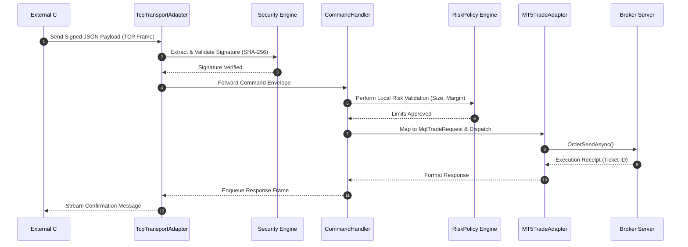
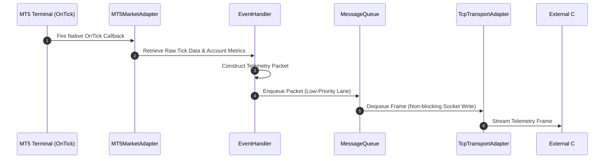

# Nexus Trading Engine (NTE) & NexusBridge

<p align="center">
  
  
  
  
</p>

The **Nexus Trading Engine (NTE)** is a production-oriented, modular algorithmic trading platform built with **.NET 10**, **WPF**, **C#**, and a native **C++20 quantitative core**. 

The **NexusBridge** acts as the high-speed edge adapter within the MetaTrader 5 environment. It connects MT5 to the NTE core, keeping the trading terminal completely decoupled from the primary decision-making engine.

---

## 🛠️ Repository Structure

```text
.
├── .github/
│   └── workflows/                       # Continuous Integration & Delivery Pipelines
├── .nexus_docs/                         # Exhaustive Architecture & Engineering Specs
├── .project/                            # Active Backlog, Session States & Master Plan
├── docs/                                # AI-Architectural Diagrams & Math Formulations
├── MQL5/
│   └── Experts/
│       └── Nexus/
│           └── NexusBridge.mq5          # Physical Monolith / Consolidated Execution Gateway
├── native/
│   └── Nexus.Native/                    # High-Performance C++20 Quantitative Library
│       ├── NexusNative.cpp
│       └── NexusNative.h
└── src/
    ├── Nexus.AI/                        # Feature Learning & Inference Interfaces
    ├── Nexus.Application/               # Orchestration, Decision Pipeline & Commands
    ├── Nexus.Core/                      # Domain Model, Core Entities & Value Objects
    ├── Nexus.Desktop/                   # Operator Workstation Dashboard
    ├── Nexus.Infrastructure/            # Database Bootstrappers, TCP Server & Mt5 Adapters
    ├── Nexus.Infrastructure.Native/     # Native interop (P/Invoke) integrations
    └── Nexus.WpfUi/                     # Main Application Entry Shell (WPF)
```

---

## 🧩 Core System Layers

### 🔴 Nexus.Core (Domain Layer)
* **Dependency Profile:** Zero external package dependencies.
* **Responsibilities:** Defines the complete core trading domain. It contains the data structures and mathematical definitions for the trading space.
* **Key Components:**
  * `MarketState`, `MarketVector`, `TradeDecision`, `ScenarioScore`, `PatternMatchResult`, and `EvaluationResult`.
  * Core value objects: `Symbol`, `Money`, and `LotSize`.
  * Abstract ports for the Strategy Runtime, Decision Engine, Risk Management, and Experience Database.
  * **Zero-Allocation Tick Path:** An execution path designed to avoid garbage collection overhead during high-frequency tick processing.

### ⚙️ Nexus.Application (Orchestration Layer)
* **Dependency Profile:** References `Nexus.Core`. No direct UI or physical database dependency.
* **Responsibilities:** Implements the core **Decision Pipeline**. It processes raw data inputs into evaluated trading decisions and coordinates system workflows.
* **Key Components:**
  * `DecisionEngine`, `ScenarioEvaluationEngine`, `AccumulatorService`, and `ExecutionCoordinator`.
  * Manages the execution lifecycle from incoming market data to state generation, risk validation, and trade dispatching.

### 🔌 Nexus.Infrastructure (Adapters Layer)
* **Dependency Profile:** Implementation layer. References external drivers, databases, and platform APIs.
* **Responsibilities:** Satisfies the application layer's abstract ports. Handles data storage, background services, and external integrations.
* **Key Components:**
  * **Database Bootstrappers:** Support for PostgreSQL (enterprise deployments) and SQLite (simple local deployments) via Entity Framework Core.
  * **Background Workers:** Ingestion and dispatch processes (`MarketDataIngestionWorker`, `ExecutionWorker`).
  * **TCP MT5 Client Bridge:** Manages socket-level serialization and protocol handling for external trading connections.

### ⚡ Nexus.Native.Core (Native C++20 Core)
* **Dependency Profile:** C++20 Shared Library (`Nexus.Native.dll`).
* **Responsibilities:** Low-latency quantitative calculations and signal generation accessed via P/Invoke.
* **Key Components:**
  * Performance indicators (EMA, SMA, RSI, ATR) and mathematical feature extraction.
  * High-performance search and optimization algorithms.
  * Generates raw mathematical `MarketVector` payloads to feed the C# application-layer pipeline.

### 🖥️ Nexus.WpfUi (.NET 10 / WPF Layer)
* **Dependency Profile:** Client-facing UI layer.
* **Responsibilities:** Provides a desktop workspace for monitoring market states, decision engine logs, risk parameters, and active portfolio metrics.
* **Key Components:**
  * MVVM-patterned dashboards (`MainViewModel`, `ManualDeskViewModel`, `DiagnosticsViewModel`).
  * System diagnostics, log streaming, and manual trade entry capabilities.

---

## 🧠 Intelligence & Execution Subsystems

The core intelligence of NTE is designed as a search-driven system, separating state evaluation from execution mechanics.

```
Market Update (Tick/Bar)
         │
         ▼
 ┌──────────────┐
 │ Nexus.Native │ ──> Low-latency Feature Extraction (ATR, RSI, Market Vector)
 └──────┬───────┘
        │
        ▼
 ┌──────────────┐
 │   Nexus.AI   │ ──> Feature Learning & Neural Evaluation (PatternMatch)
 └──────┬───────┘
        │
        ▼
 ┌──────────────┐
 │ Search Engine│ ──> Candidate Action Generation & Path Tree Search
 └──────┬───────┘
        │
        ▼
 ┌──────────────┐
 │  Risk Guard  │ ──> Pre-Trade Safety Check (Daily Loss, Size Constraints)
 └──────┬───────┘
        │
        ▼
 ┌──────────────┐
 │ NexusBridge  │ ──> Execution via Broker Gateway (MetaTrader 5)
 └──────────────┘
```

### 🤖 Nexus.AI
* **Role:** AI-assisted Market Intelligence.
* **Design Philosophy:** Rather than allowing neural networks to place trades directly, AI models serve as evaluators within a structured decision tree (similar to modern chess engine architectures like Stockfish).
* **Key Actions:** Feature learning, neural evaluation, confidence estimation, pattern recognition, and continuous training model generation.

### 📚 Experience & Training Engine
* **Role:** Data Logging and Offline Training Pipelines.
* **Design Philosophy:** Every trade lifecycle, market condition, decision, and financial outcome is stored systematically to improve future decision-making.
* **Key Actions:** Records complete `MarketState` and `TradeDecision` data points to generate clean training datasets. This helps improve scenario ranking, pattern validation, and neural model fine-tuning over time.

### 🔍 Search & Decision Engine
* **Role:** Strategy Action Selection.
* **Design Philosophy:** Evaluates multiple potential actions, projecting probability curves across various scenarios while pruning high-risk or low-confidence paths.
* **Key Actions:** Generates candidate trading choices, runs Monte Carlo-style evaluations on projected price targets, and selects the optimal path that fits within defined risk constraints.

### 📈 MetaTrader 5 Integration Layer
* **Role:** Execution Gateway.
* **Design Philosophy:** MT5 serves strictly as an execution endpoint and telemetry provider. The platform remains decoupled from the core strategy logic, allowing for future integrations with other trading platforms or FIX engines without rewrite of the domain layer.

---

## ⚙️ NexusBridge: Consolidated Deployment Architecture

For deployment, MT5 requires a simple and robust installation process. Rather than managing dozens of separate header files inside MT5's sandboxed environment (which complicates version control, installation, and performance), **NexusBridge is packaged and deployed as a highly optimized physical monolith: `NexusBridge.mq5`**.

This file organizes the logical clean architecture segments into strict **namespaces and class structures** directly inside the script, combining performance with maintainability.

```
┌────────────────────────────────────────────────────────────────────────┐
│                          NexusBridge.mq5                               │
├────────────────────────────────────────────────────────────────────────┤
│  ┌───────────────────────┐   ┌───────────────────────┐                 │
│  │    Namespace Core     │   │  Namespace Security   │                 │
│  │ • Bootstrapping       │   │ • HMAC SHA-256 Sign   │                 │
│  │ • Configuration       │   │ • Payload Sanity      │                 │
│  └───────────────────────┘   └───────────────────────┘                 │
│  ┌───────────────────────┐   ┌───────────────────────┐                 │
│  │  Namespace Protocol   │   │  Namespace Messaging  │                 │
│  │ • JSON Serializer     │   │ • Priority Tx Queue   │                 │
│  │ • Struct Mapping      │   │ • Non-Blocking Socket │                 │
│  └───────────────────────┘   └───────────────────────┘                 │
│  ┌───────────────────────────────────────────────────┐                 │
│  │               Namespace Adapters                  │                 │
│  │  • MT5TradeAdapter (Wraps Native API)             │                 │
│  │  • MT5MarketAdapter (Low-latency Telemetry)       │                 │
│  └───────────────────────────────────────────────────┘                 │
└────────────────────────────────────────────────────────────────────────┘
```

---

## 🔄 Core System Workflows

### 1. Inbound Order Execution Pipeline
This model highlights the sequence of an incoming buy request. The system runs the request through signature verification and risk checks before calling the native MT5 trading engine.



### 2. High-Frequency Telemetry Stream
This workflow illustrates how the bridge processes high-density price feeds and indicators, keeping the external trading system updated with local market conditions.



---

## 🔌 API & Communication Schemas

The C# engine (under `src/Nexus.Application/Mt5Bridge/Contracts/`) communicates with the compiled MQL5 bridge over TCP. All network payloads share a standard schema envelope.

### 1. PlaceOrderRequest (`PlaceOrderRequest.cs`)
```json
{
  "header": {
    "message_id": "9bc32d10-f823-11ef-93a0-12010a760002",
    "correlation_id": "402941-e23a",
    "timestamp": 1740003010,
    "token": "7a9f82dcd12f45ea8cde",
    "signature": "e3b0c44298fc1c149afbf4c8996fb92427ae41e4649b934ca495991b7852b855"
  },
  "command": "PlaceOrder",
  "payload": {
    "symbol": "XAUUSD",
    "order_type": 0,
    "volume": 0.15,
    "price": 2353.40,
    "sl": 2340.00,
    "tp": 2375.00,
    "magic_number": 100204,
    "slippage": 30
  }
}
```

### 2. PlaceOrderResponse (`PlaceOrderResponse.cs`)
```json
{
  "header": {
    "message_id": "9bc32d10-f823-11ef-93a0-12010a760002",
    "correlation_id": "402941-e23a",
    "timestamp": 1740003011
  },
  "status": "SUCCESS",
  "payload": {
    "ticket_id": 98572114,
    "execution_price": 2353.42,
    "actual_volume": 0.15,
    "retcode": 10009
  }
}
```

---

## 🛡️ Reliability & Fail-Safe Mechanisms

> [!IMPORTANT]
> To prevent execution inconsistencies during network dropouts or broker disconnects, the system uses the following safeguards:

* **Zero-Trust State Sync:** If connection is lost, the `RecoveryManager` immediately queries active tickets directly from the broker upon reconnecting. This matches the internal cache with actual broker data before resuming external communication.
* **Pre-Trade Risk Limits:** The `RiskPolicy` checks all incoming order volumes, leverage, and margin requirements against strict local boundaries, blocking executions that violate limits.
* **Outbound Message Queues:** A non-blocking buffer prioritizes execution reports over tick messages, preventing order feedback from being delayed by high-density price streams.

---

## 🚀 Build and Deploying the System

### Prerequisites
* Windows 11 workstation.
* **.NET 10 SDK** (for the WpfUi, Application, and Infrastructure projects).
* **MSVC C++ Compiler / CMake** with C++20 support (for building `Nexus.Native.Core`).
* **MetaTrader 5 Client Terminal** with Algo Trading enabled.

### Compilation

1. **Build the C++ Native Core:**
   ```bash
   cd native
   cmake -B build -DCMAKE_BUILD_TYPE=Release
   cmake --build build --config Release
   ```
   *This outputs the `NexusNative.dll` assembly to the platform's execution folder.*

2. **Build the .NET 10 System Solution:**
   ```bash
   dotnet restore NexusTradingEngine.sln
   dotnet build NexusTradingEngine.sln --configuration Release
   ```

3. **Install & Compile the MQL5 Gateway:**
   * Copy the physical file `MQL5/Experts/Nexus/NexusBridge.mq5` into your MT5 terminal's `MQL5/Experts/Nexus/` directory.
   * Open MetaEditor and compile `NexusBridge.mq5` (`F7`). Ensure no errors are reported in the output log.
   * Drag the **NexusBridge** expert advisor onto your target chart, checking **"Allow Algo Trading"** and **"Allow DLL Imports"** in the EA options dialog.
