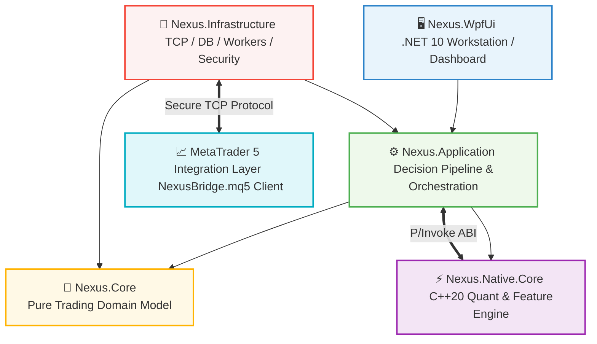
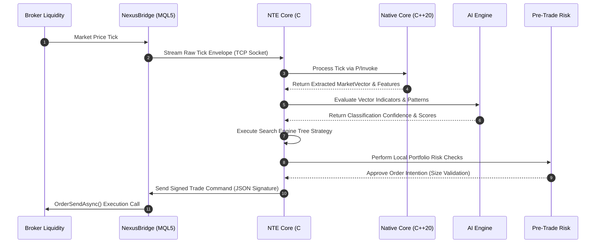

# Nexus Trading Engine (NTE) & NexusBridge

<p align="center">
  
  
  
  
</p>

The **Nexus Trading Engine (NTE)** is a modular, production-oriented algorithmic trading platform built on **.NET 10**, **WPF**, **C#**, and a native **C++20 quantitative core**. 

The **NexusBridge** is the system's MetaTrader 5 edge adapter. It runs within the MT5 terminal to supply real-time market telemetry and execute incoming trading commands, keeping the main decision-making logic decoupled from terminal-specific dependencies.

---

## 🧭 Agent-Friendly Architectural Directory Index

For AI development agents (e.g., Copilot, Cursor) and system contributors, use this index to locate core features across the codebase.

| Subsystem / Layer | Primary Purpose | Key Target Directory / Files |
| :--- | :--- | :--- |
| **Domain Layer** | Zero-dependency trading rules, entities, and state objects. | `src/Nexus.Core/` |
| **Application Layer** | Decision pipelines, strategy hosting, command/query dispatching. | `src/Nexus.Application/` |
| **Infrastructure Layer**| DB persistence, background workers, and TCP server adapters. | `src/Nexus.Infrastructure/` |
| **Native Quant Core** | Low-latency feature extraction and mathematical calculations. | `native/Nexus.Native/` |
| **Execution Bridge** | Consolidated MT5 execution client and telemetry streamer. | `MQL5/Experts/Nexus/NexusBridge.mq5` |
| **Operator UI** | Desktop system monitoring and manual control dashboard. | `src/Nexus.Desktop/`, `src/Nexus.WpfUi/` |

---

## 🏛️ System Architecture Overview

The system uses a **decoupled ports-and-adapters (hexagonal) architecture** to isolate runtime-specific dependencies from core trading logic.



---

## 🔌 NexusBridge: Internal Logical Architecture

To simplify deployment within MetaTrader 5's sandboxed filesystem, **NexusBridge is packaged as a consolidated file: `NexusBridge.mq5`**. 

Internally, this file is organized using strict namespaces and classes to maintain clear clean-architecture boundaries.

```
┌────────────────────────────────────────────────────────────────────────┐
│                          NexusBridge.mq5                               │
├────────────────────────────────────────────────────────────────────────┤
│  ┌───────────────────────┐   ┌───────────────────────┐                 │
│  │    Namespace Core     │   │  Namespace Security   │                 │
│  │ • Bootstrapping       │   │ • HMAC SHA-256 Sign   │                 │
│  │ • Configuration       │   │ • Payload Sanity      │                 │
│  └───────────────────────┘   └───────────────────────┘                 │
│  ┌───────────────────────┐   ┌───────────────────────┐                 │
│  │  Namespace Protocol   │   │  Namespace Messaging  │                 │
│  │ • JSON Serializer     │   │ • Priority Tx Queue   │                 │
│  │ • Struct Mapping      │   │ • Non-Blocking Socket │                 │
│  └───────────────────────┘   └───────────────────────┘                 │
│  ┌───────────────────────────────────────────────────┐                 │
│  │               Namespace Adapters                  │                 │
│  │  • MT5TradeAdapter (Wraps Native API)             │                 │
│  │  • MT5MarketAdapter (Low-latency Telemetry)       │                 │
│  └───────────────────────────────────────────────────┘                 │
└────────────────────────────────────────────────────────────────────────┘
```

---

## 🔄 End-to-End Execution Flow

This diagram outlines how a market tick initiates a state change and leads to strategy evaluation and trade execution.



---

## 📁 Technical Data Contracts (Wire Protocol)

The C# infrastructure layer (`src/Nexus.Infrastructure/Mt5Bridge/`) and the compiled MQL5 bridge exchange structured, cryptographically signed JSON packets over a TCP socket.

### 1. PlaceOrderRequest
* **Associated C# Class:** `src/Nexus.Application/Mt5Bridge/Contracts/PlaceOrderRequest.cs`
* **Trigger:** Dispatched by the external execution coordinator upon valid trade signals.

```json
{
  "header": {
    "message_id": "9bc32d10-f823-11ef-93a0-12010a760002",
    "correlation_id": "402941-e23a",
    "timestamp": 1740003010,
    "token": "7a9f82dcd12f45ea8cde",
    "signature": "e3b0c44298fc1c149afbf4c8996fb92427ae41e4649b934ca495991b7852b855"
  },
  "command": "PlaceOrder",
  "payload": {
    "symbol": "XAUUSD",
    "order_type": 0,
    "volume": 0.15,
    "price": 2353.40,
    "sl": 2340.00,
    "tp": 2375.00,
    "magic_number": 100204,
    "slippage": 30
  }
}
```

### 2. PlaceOrderResponse
* **Associated C# Class:** `src/Nexus.Application/Mt5Bridge/Contracts/PlaceOrderResponse.cs`
* **Trigger:** Generated by `MT5TradeAdapter` inside `NexusBridge.mq5` following an `OrderSend()` update.

```json
{
  "header": {
    "message_id": "9bc32d10-f823-11ef-93a0-12010a760002",
    "correlation_id": "402941-e23a",
    "timestamp": 1740003011
  },
  "status": "SUCCESS",
  "payload": {
    "ticket_id": 98572114,
    "execution_price": 2353.42,
    "actual_volume": 0.15,
    "retcode": 10009
  }
}
```

---

## 🔀 Migration & Integration: Standard MQL5 vs. Nexus Decoupled Architecture

The diagram below compares a traditional, self-contained MQL5 Expert Advisor with the decoupled, high-performance architecture utilized by Nexus.

```
Traditional MQL5 EA (Blocking, Sandboxed Execution)
┌────────────────────────────────────────────────────────────────────────┐
│ MetaTrader 5 Terminal Process                                          │
│  OnTick() ──> [Indicator Calculations] ──> [Risk Checks] ──> OrderSend │
└────────────────────────────────────────────────────────────────────────┘

Nexus Decoupled System (Asynchronous, Parallel Computation)
┌──────────────────────────────────────┐     ┌───────────────────────────┐
│ MetaTrader 5 Terminal                │     │ External Core (NTE)       │
│  OnTick() ──> Stream Telemetry ──────┼────>│ • C++20 Feature Extraction│
│                                      │     │ • AI Inference Scoring    │
│  Execution ◄── Recv Secure Command ◄─┼─────│ • Global Risk Checking    │
└──────────────────────────────────────┘     └───────────────────────────┘
```

### Traditional Indicator-Based EA (`te.mq5`)

In traditional setups, indicator calculations (such as Accelerator Oscillator evaluations) and risk calculations run sequentially on the main terminal thread. This can introduce execution latencies during fast-moving market sessions.

Below is a standard MQL5 Expert Advisor reference using native classes (`CExpert`, `CExpertSignal`, `CSignalAC`, `CTrailingFixedPips`, `CMoneyFixedMargin`):

<details>
<summary><b>View Traditional Indicator-Based EA (Standard Library Class Example)</b></summary>

```mql5
//+------------------------------------------------------------------+
//|                                                           te.mq5 |
//|                                  Copyright 2026, MetaQuotes Ltd. |
//|                                             https://www.mql5.com |
//+------------------------------------------------------------------+
#property copyright "Copyright 2026, MetaQuotes Ltd."
#property link      "https://www.mql5.com"
#property version   "1.00"
//+------------------------------------------------------------------+
//| Include                                                          |
//+------------------------------------------------------------------+
#include <Expert\Expert.mqh>
//--- available signals
#include <Expert\Signal\SignalAC.mqh>
//--- available trailing
#include <Expert\Trailing\TrailingFixedPips.mqh>
//--- available money management
#include <Expert\Money\MoneyFixedMargin.mqh>
//+------------------------------------------------------------------+
//| Inputs                                                           |
//+------------------------------------------------------------------+
//--- inputs for expert
input string Expert_Title                  ="te";        // Document name
ulong        Expert_MagicNumber            =-1036136456; //
bool         Expert_EveryTick              =false;       //
//--- inputs for main signal
input int    Signal_ThresholdOpen          =10;          // Signal threshold value to open [0...100]
input int    Signal_ThresholdClose         =10;          // Signal threshold value to close [0...100]
input double Signal_PriceLevel             =0.0;         // Price level to execute a deal
input double Signal_StopLevel              =50.0;        // Stop Loss level (in points)
input double Signal_TakeLevel              =50.0;        // Take Profit level (in points)
input int    Signal_Expiration             =4;           // Expiration of pending orders (in bars)
input double Signal_2_AC_Weight            =1.0;         // Accelerator Oscillator M2 Weight [0...1.0]
input double Signal_3_AC_Weight            =1.0;         // Accelerator Oscillator M5 Weight [0...1.0]
input double Signal_4_AC_Weight            =1.0;         // Accelerator Oscillator M15 Weight [0...1.0]
//--- inputs for trailing
input int    Trailing_FixedPips_StopLevel  =30;          // Stop Loss trailing level (in points)
input int    Trailing_FixedPips_ProfitLevel=50;          // Take Profit trailing level (in points)
//--- inputs for money
input double Money_FixMargin_Percent       =10.0;        // Percentage of margin
//+------------------------------------------------------------------+
//| Global expert object                                             |
//+------------------------------------------------------------------+
CExpert ExtExpert;
//+------------------------------------------------------------------+
//| Initialization function of the expert                            |
//+------------------------------------------------------------------+
int OnInit()
  {
//--- Initializing expert
   if(!ExtExpert.Init(Symbol(),Period(),Expert_EveryTick,Expert_MagicNumber))
     {
      //--- failed
      printf(__FUNCTION__+": error initializing expert");
      ExtExpert.Deinit();
      return(INIT_FAILED);
     }
//--- Creating signal
   CExpertSignal *signal=new CExpertSignal;
   if(signal==NULL)
     {
      //--- failed
      printf(__FUNCTION__+": error creating signal");
      ExtExpert.Deinit();
      return(INIT_FAILED);
     }
//---
   ExtExpert.InitSignal(signal);
   signal.ThresholdOpen(Signal_ThresholdOpen);
   signal.ThresholdClose(Signal_ThresholdClose);
   signal.PriceLevel(Signal_PriceLevel);
   signal.StopLevel(Signal_StopLevel);
   signal.TakeLevel(Signal_TakeLevel);
   signal.Expiration(Signal_Expiration);
//--- Creating filter CSignalAC
   CSignalAC *filter0=new CSignalAC;
   if(filter0==NULL)
     {
      //--- failed
      printf(__FUNCTION__+": error creating filter0");
      ExtExpert.Deinit();
      return(INIT_FAILED);
     }
   signal.AddFilter(filter0);
//--- Set filter parameters
//--- Creating filter CSignalAC
   CSignalAC *filter1=new CSignalAC;
   if(filter1==NULL)
     {
      //--- failed
      printf(__FUNCTION__+": error creating filter1");
      ExtExpert.Deinit();
      return(INIT_FAILED);
     }
   signal.AddFilter(filter1);
//--- Set filter parameters
   filter1.Period(PERIOD_M1);
//--- Creating filter CSignalAC
   CSignalAC *filter2=new CSignalAC;
   if(filter2==NULL)
     {
      //--- failed
      printf(__FUNCTION__+": error creating filter2");
      ExtExpert.Deinit();
      return(INIT_FAILED);
     }
   signal.AddFilter(filter2);
//--- Set filter parameters
   filter2.Period(PERIOD_M2);
   filter2.Weight(Signal_2_AC_Weight);
//--- Creating filter CSignalAC
   CSignalAC *filter3=new CSignalAC;
   if(filter3==NULL)
     {
      //--- failed
      printf(__FUNCTION__+": error creating filter3");
      ExtExpert.Deinit();
      return(INIT_FAILED);
     }
   signal.AddFilter(filter3);
//--- Set filter parameters
   filter3.Period(PERIOD_M5);
   filter3.Weight(Signal_3_AC_Weight);
//--- Creating filter CSignalAC
   CSignalAC *filter4=new CSignalAC;
   if(filter4==NULL)
     {
      //--- failed
      printf(__FUNCTION__+": error creating filter4");
      ExtExpert.Deinit();
      return(INIT_FAILED);
     }
   signal.AddFilter(filter4);
//--- Set filter parameters
   filter4.Period(PERIOD_M15);
   filter4.Weight(Signal_4_AC_Weight);
//--- Creation of trailing object
   CTrailingFixedPips *trailing=new CTrailingFixedPips;
   if(trailing==NULL)
     {
      //--- failed
      printf(__FUNCTION__+": error creating trailing");
      ExtExpert.Deinit();
      return(INIT_FAILED);
     }
//--- Add trailing to expert (will be deleted automatically))
   if(!ExtExpert.InitTrailing(trailing))
     {
      //--- failed
      printf(__FUNCTION__+": error initializing trailing");
      ExtExpert.Deinit();
      return(INIT_FAILED);
     }
//--- Set trailing parameters
   trailing.StopLevel(Trailing_FixedPips_StopLevel);
   trailing.ProfitLevel(Trailing_FixedPips_ProfitLevel);
//--- Creation of money object
   CMoneyFixedMargin *money=new CMoneyFixedMargin;
   if(money==NULL)
     {
      //--- failed
      printf(__FUNCTION__+": error creating money");
      ExtExpert.Deinit();
      return(INIT_FAILED);
     }
//--- Add money to expert (will be deleted automatically))
   if(!ExtExpert.InitMoney(money))
     {
      //--- failed
      printf(__FUNCTION__+": error initializing money");
      ExtExpert.Deinit();
      return(INIT_FAILED);
     }
//--- Set money parameters
   money.Percent(Money_FixMargin_Percent);
//--- Check all trading objects parameters
   if(!ExtExpert.ValidationSettings())
     {
      //--- failed
      ExtExpert.Deinit();
      return(INIT_FAILED);
     }
//--- Tuning of all necessary indicators
   if(!ExtExpert.InitIndicators())
     {
      //--- failed
      printf(__FUNCTION__+": error initializing indicators");
      ExtExpert.Deinit();
      return(INIT_FAILED);
     }
//--- ok
   return(INIT_SUCCEEDED);
  }
//+------------------------------------------------------------------+
//| Deinitialization function of the expert                          |
//+------------------------------------------------------------------+
void OnDeinit(const int reason)
  {
   ExtExpert.Deinit();
  }
//+------------------------------------------------------------------+
//| "Tick" event handler function                                    |
//+------------------------------------------------------------------+
void OnTick()
  {
   ExtExpert.OnTick();
  }
//+------------------------------------------------------------------+
//| "Trade" event handler function                                   |
//+------------------------------------------------------------------+
void OnTrade()
  {
   ExtExpert.OnTrade();
  }
//+------------------------------------------------------------------+
//| "Timer" event handler function                                   |
//+------------------------------------------------------------------+
void OnTimer()
  {
   ExtExpert.OnTimer();
  }
//+------------------------------------------------------------------+
```
</details>

### Integrating Traditional Indicator Filters with Nexus

When migrating indicators (such as the AC oscillator shown above) or trailing setups to NTE's decoupled architecture:

1. **Calculate Indicators in C++:** Traditional indicators are migrated to `native/Nexus.Native/`, which uses optimized loop operations to calculate indicator vectors. This offloads calculation-heavy indicator tasks from the MT5 terminal thread.
2. **Standardized Telemetry Pipelines:** The indicator outputs are packaged into a structured telemetry format (such as the `MarketUpdateEvent` JSON format) and sent over the socket connection to the C# application layer.
3. **Decoupled Stop and Trailing Management:** Instead of managing stop losses and trailing points within MT5's standard library classes (`CTrailingFixedPips`), trailing orders are calculated in the C# strategy runtime and executed as individual, targeted `PlaceOrder` or modification commands.

---

## 🛡️ Reliability & Fail-Safe Mechanisms

To ensure system stability during network dropouts or terminal restarts, the bridge operates under three core resilience rules:

> [!IMPORTANT]
> **1. Zero-Trust Recovery Engine**
> If the TCP connection is lost, outbound trade queues are frozen. Upon reconnection, the system queries current active tickets directly from the broker, updating the local cache before resuming external communications.

> [!WARNING]
> **2. Pre-Trade Gatekeeping**
> To safeguard the account, the local risk engine validates all incoming trade requests against predefined leverage and margin boundaries *before* passing them to the native execution API.

> [!NOTE]
> **3. Message Queue Prioritization**
> Outbound messages use a priority-lane structure. Trade confirmations and risk updates are sent through a high-priority lane to prevent processing delays from high-density telemetry data (such as raw price ticks).

---

## 🚀 Build & Installation Guide

### Prerequisites
* Windows 11 workstation.
* **.NET 10 SDK** (for the WpfUi, Application, and Infrastructure projects).
* **MSVC C++ Compiler / CMake** with C++20 support (for building `Nexus.Native.Core`).
* **MetaTrader 5 Client Terminal** with Algo Trading enabled.

### Compile & Deploy

#### 1. Compile the Native Math Core
```bash
cd native
cmake -B build -DCMAKE_BUILD_TYPE=Release
cmake --build build --config Release
```
*This places `NexusNative.dll` into your execution path.*

#### 2. Build the Core C# Platform
```bash
dotnet restore NexusTradingEngine.sln
dotnet build NexusTradingEngine.sln --configuration Release
```

#### 3. Deploy the MQL5 Gateway
1. Locate your MT5 terminal directory's `MQL5` folder.
2. Copy `MQL5/Experts/Nexus/NexusBridge.mq5` into that directory.
3. Open **MetaEditor** (`F4`), select `NexusBridge.mq5`, and click **Compile** (`F7`).
4. In MT5, drag **NexusBridge** onto a chart.
5. In the Expert options dialog, check **"Allow Algo Trading"** and **"Allow DLL Imports"** (required for system-level WinAPI socket connections).
