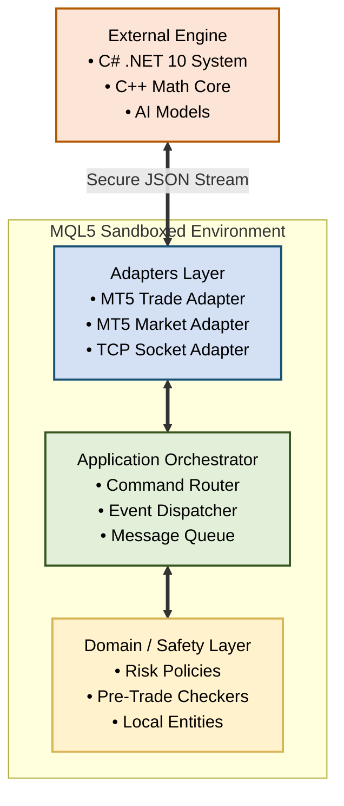
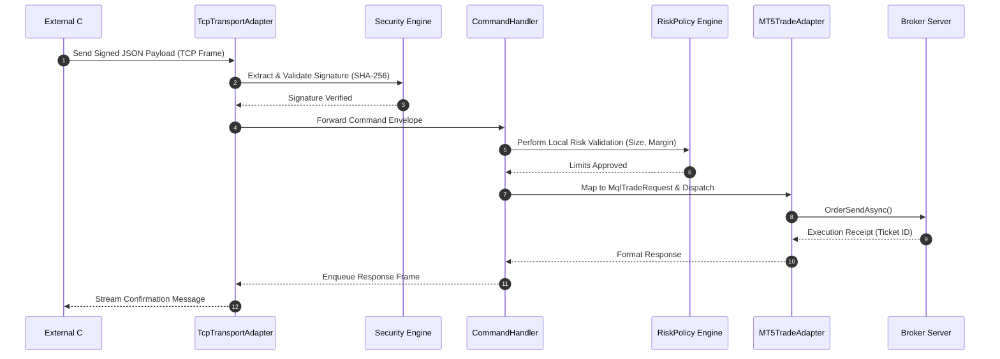
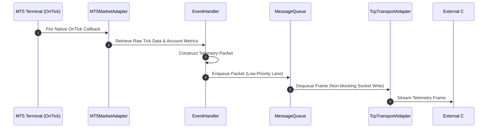

# NexusBridge MT5

<p align="center">
  
  
  
  
</p>

NexusBridge is the low-latency execution and telemetry edge adapter for the **Nexus Trading Engine (NTE)**. It connects the MetaTrader 5 terminal with high-performance external systems (such as C# .NET 10 core engines, Python AI systems, or C++ quantitative runtimes).

This bridge is designed with a **pragmatic hybrid architecture** to work within the runtime limitations of MQL5 (such as the lack of reflection, dynamic assembly loading, or complex generic collections). It delegates all heavy analytical tasks, portfolio optimization, and machine learning models to the external NTE system, keeping the MQL5 component lightweight, responsive, and reliable.

---

## 🏛️ System Architecture Map

The system uses a **decoupled ports-and-adapters (hexagonal) layout** inside MQL5, ensuring that the core trade execution logic remains isolated from raw network protocols and data formats.



---

## 📂 Project Anatomy

```text
MQL5/
└── Experts/
    └── Nexus/
        ├── NexusBridge.mq5              # EA Entry Point & Static Composition Root
        │
        ├── Core/                        # System Bootstrapping & Shared Context
        │   ├── Bootstrap.mqh            # Static object graph constructor
        │   ├── Constants.mqh            # Global system boundaries and error codes
        │   ├── AppContext.mqh           # Global access reference for core systems
        │   └── Exceptions.mqh           # Base structural error definitions
        │
        ├── Interfaces/                  # Abstract Contracts (Inversion Ports)
        │   ├── ITradeService.mqh        # Contract for placing and modifying positions
        │   ├── IMarketService.mqh       # Contract for accessing indicator & candle data
        │   └── IMessageTransport.mqh    # Contract for outbound TCP / frame transport
        │
        ├── Application/                 # Use Case Managers & Orchestrators
        │   ├── CommandHandler.mqh       # Parses and dispatches incoming system commands
        │   ├── EventHandler.mqh         # Marshals local trade/tick updates to transport
        │   └── MessageQueue.mqh         # Prioritized outbound messaging buffer
        │
        ├── Adapters/                    # Concrete Implementations of Interfaces
        │   ├── MT5TradeAdapter.mqh      # Wraps native OrderSend and OrderSendAsync API
        │   ├── MT5MarketAdapter.mqh     # Handles native tick capture and historic MqlRates
        │   └── TcpTransportAdapter.mqh  # Manages low-level WinAPI TCP socket connections
        │
        ├── Protocol/                    # Wire-Format Serialization & Validation
        │   ├── RequestModels.mqh        # Struct definitions for incoming action payloads
        │   ├── ResponseModels.mqh       # Struct definitions for outbound acknowledgements
        │   └── JsonSerializer.mqh       # Lightweight, manual string builder for JSON serialization
        │
        └── Security/                    # Inbound Command Verification
            ├── Authentication.mqh       # Cryptographic signature validation (SHA-256)
            └── InputValidator.mqh       # Range checks to prevent out-of-bounds orders
```

---

## 🔄 Core System Workflows

### 1. Inbound Order Execution Pipeline
This model highlights the sequence of an incoming buy request. The system runs the request through signature verification and risk checks before calling the native MT5 trading engine.



### 2. High-Frequency Telemetry Stream
This workflow illustrates how the bridge processes high-density price feeds and indicators, keeping the external trading system updated with local market conditions.



---

## 🛠️ Implementation Specs (MQL5 Decoupled Design)

This compile-time composition pattern avoids complex runtime DI engines while preserving the benefits of dependency inversion.

### Step 1: Abstract Port Definition (`ITradeService.mqh`)
```mql5
// ITradeService.mqh
#include "../Protocol/RequestModels.mqh"
#include "../Protocol/ResponseModels.mqh"

class ITradeService
{
public:
   virtual      ~ITradeService() {}
   
   virtual bool PlaceOrder(const PlaceOrderRequest &request, PlaceOrderResponse &out_response) = 0;
   virtual bool ClosePosition(const ClosePositionRequest &request, ClosePositionResponse &out_response) = 0;
};
```

### Step 2: Concrete Adapter Implementation (`MT5TradeAdapter.mqh`)
```mql5
// MT5TradeAdapter.mqh
#include "../Interfaces/ITradeService.mqh"

class MT5TradeAdapter : public ITradeService
{
public:
   virtual ~MT5TradeAdapter() {}

   virtual bool PlaceOrder(const PlaceOrderRequest &request, PlaceOrderResponse &out_response) override
   {
      MqlTradeRequest mqlRequest = {};
      MqlTradeResult  mqlResult  = {};

      // Map request parameters to native MQL structs
      mqlRequest.action       = TRADE_ACTION_DEAL;
      mqlRequest.symbol       = request.Symbol;
      mqlRequest.volume       = request.Volume;
      mqlRequest.type         = (ENUM_ORDER_TYPE)request.OrderType;
      mqlRequest.price        = request.Price;
      mqlRequest.sl           = request.StopLoss;
      mqlRequest.tp           = request.TakeProfit;
      mqlRequest.magic        = request.MagicNumber;
      mqlRequest.deviation    = request.Slippage;
      mqlRequest.comment      = "NTE Direct Link";

      ResetLastError();
      bool success = OrderSend(mqlRequest, mqlResult);

      // Populate response parameters
      out_response.Retcode = mqlResult.retcode;
      out_response.Ticket  = mqlResult.order;
      out_response.Price   = mqlResult.price;
      out_response.Volume  = mqlResult.volume;
      out_response.Success = (success && mqlResult.retcode == TRADE_RETCODE_DONE);

      return out_response.Success;
   }

   virtual bool ClosePosition(const ClosePositionRequest &request, ClosePositionResponse &out_response) override
   {
      // Native close validation logic
      return false; 
   }
};
```

### Step 3: Application Initialization (`NexusBridge.mq5`)
```mql5
// NexusBridge.mq5
#include "Core/AppContext.mqh"
#include "Adapters/MT5TradeAdapter.mqh"
#include "Adapters/TcpTransportAdapter.mqh"

// Statically allocated system instances
MT5TradeAdapter     g_TradeAdapter;
TcpTransportAdapter g_TcpAdapter;

int OnInit()
{
   // Bind service implementations to application contexts
   AppContext::TradeService = &g_TradeAdapter;
   AppContext::Transport    = &g_TcpAdapter;
   
   if(!g_TcpAdapter.Connect())
   {
      Print("[NTE BRIDGE] [WARN] TCP transport failed initialization. Retrying in background loop...");
   }

   Print("[NTE BRIDGE] System initialized successfully.");
   return(INIT_SUCCEEDED);
}

void OnDeinit(const int reason)
{
   g_TcpAdapter.Disconnect();
}
```

---

## 🔒 Security & Data Contracts

Every network command payload processed by the bridge is structured and authenticated using SHA-256 HMAC tokens, preventing unauthorized network traffic from interacting with the terminal.

### 1. Inbound Execution Envelope
```json
{
  "header": {
    "message_id": "9bc32d10-f823-11ef-93a0-12010a760002",
    "correlation_id": "402941-e23a",
    "timestamp": 1740003010,
    "token": "7a9f82dcd12f45ea8cde",
    "signature": "e3b0c44298fc1c149afbf4c8996fb92427ae41e4649b934ca495991b7852b855"
  },
  "command": "PlaceOrder",
  "payload": {
    "symbol": "XAUUSD",
    "order_type": 0,
    "volume": 0.15,
    "price": 2353.40,
    "sl": 2340.00,
    "tp": 2375.00,
    "magic_number": 100204,
    "slippage": 30
  }
}
```

### 2. Market Data & Indicator Update Payload
```json
{
  "header": {
    "message_id": "c623d3a0-f823-11ef-bcfe-22010a760002",
    "timestamp": 1740003000
  },
  "event_name": "MarketUpdateEvent",
  "payload": {
    "symbol": "XAUUSD",
    "timeframe": "M5",
    "ohlcv": {
      "open": 2350.10,
      "high": 2355.80,
      "low": 2348.00,
      "close": 2353.40,
      "volume": 12050
    },
    "indicators": {
      "rsi_14": 64.21,
      "ema_50": 2340.45,
      "atr_14": 15.20
    }
  }
}
```

---

## 🛡️ Reliability & Fail-Safe Mechanisms

> [!IMPORTANT]
> To prevent execution inconsistencies during network dropouts or broker disconnects, the system uses the following safeguards:

* **Zero-Trust State Sync:** If connection is lost, the `RecoveryManager` immediately queries active tickets directly from the broker upon reconnecting. This matches the internal cache with actual broker data before resuming external communication.
* **Pre-Trade Risk Limits:** The `RiskPolicy` checks all incoming order volumes, leverage, and margin requirements against strict local boundaries, blocking executions that violate limits.
* **Outbound Message Queues:** A non-blocking buffer prioritizes execution reports over tick messages, preventing order feedback from being delayed by high-density price streams.

---

## 🚀 Deployment Guide

### Building from Source
1. Open your MT5 terminal directory.
2. Clone this repository directly into your local folder tree:
   `MQL5/Experts/Nexus/`
3. Launch **MetaEditor** (`F4`).
4. Open the primary executable: `Nexus/NexusBridge.mq5`.
5. Compile the file (`F7`). Ensure no errors are reported in the output log.

### Attaching the EA
1. In MT5, open the **Navigator Window** (`Ctrl+N`).
2. Drag and drop **NexusBridge** onto a chart.
3. Check **"Allow Algo Trading"** in the options dialog.
4. Navigate to the **Common** tab and check **"Allow DLL Imports"** (required for system-level WinAPI TCP socket connections).
