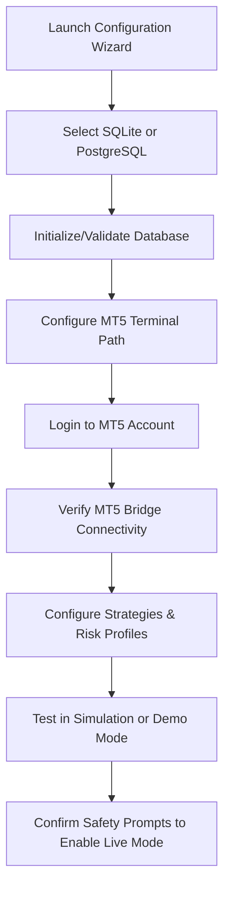

Here is the complete, professionally formatted `README.md` translated and structured in English.

---

# Nexus Trading Engine (NTE)

[](https://github.com/Opselon/QuantitativeTradeBot)
[](https://dotnet.microsoft.com/)
[](https://dotnet.microsoft.com/)
[](https://learn.microsoft.com/en-us/dotnet/csharp/)
[](https://visualstudio.microsoft.com/)
[](https://www.postgresql.org/)

The **Nexus Trading Engine (NTE)** is a production-oriented Windows algorithmic trading platform built with .NET 10, WPF, C#, and a native C++ quantitative core.

NTE connects to MetaTrader 5 through a dedicated bridge and enables users to:

*   Connect to an existing MetaTrader 5 trading account.
*   Configure and run automated trading strategies.
*   Place and close trades manually.
*   Track open positions continuously.
*   Apply strategy-driven exit, reversal, scaling, and hedging decisions.
*   Enforce risk controls before every trading action.
*   Operate in Simulation, Demo, or Live mode.
*   Use SQLite for simple local deployment or PostgreSQL for professional deployment.
*   Install and run the complete platform through a Windows installer.

> [!WARNING]  
> **Financial Risk Disclaimer:** NTE is a trading and automation platform, not financial advice. Live trading involves financial risk. Simulation and demo validation must be completed before enabling live execution.

---

## 📌 Table of Contents
- [High-Level Architecture](#high-level-architecture)
- [Instructions for AI Agents and Contributors](#instructions-for-ai-agents-and-contributors)
  - [Agent Operating Rules](#agent-operating-rules)
  - [Prohibited Patterns](#prohibited-patterns)
- [Product Vision](#product-vision)
- [Product Scope](#product-scope)
- [Supported Operating Modes](#supported-operating-modes)
- [Contributing](#-contributing)

---

## High-Level Architecture

The Nexus Trading Engine (NTE) is organized as a layered, decoupled, and extensible architecture following:

*   Domain-Driven Design (DDD)
*   Clean Architecture
*   Hexagonal Architecture (Ports & Adapters)
*   SOLID Principles
*   Dependency Injection
*   Async-First Design

### System Architecture Overview

```text
Nexus Trading Engine (NTE)

┌─────────────────────────────────────┐
│             Nexus.WpfUi             │
├─────────────────────────────────────┤
│ Operator Dashboard                  │
│ Strategy Management                 │
│ MT5 Trading Panel                   │
│ Position Monitoring                 │
│ Risk Monitoring                     │
│ Reporting & Analytics               │
│ Configuration Wizard                │
└─────────────────┬───────────────────┘
                  │
                  ▼
┌─────────────────────────────────────┐
│         Nexus.Application           │
├─────────────────────────────────────┤
│ Execution Coordinator               │
│ Strategy Coordinator                │
│ Risk Orchestrator                   │
│ Portfolio Coordinator               │
│ Position Tracking Engine            │
│ Trade Lifecycle Management          │
│ IMt5TradingService                  │
│ Application Commands & Queries      │
└─────────────────┬───────────────────┘
                  │
                  ▼
┌─────────────────────────────────────┐
│            Nexus.Domain             │
├─────────────────────────────────────┤
│ Orders                              │
│ Positions                           │
│ Trades                              │
│ Accounts                            │
│ Strategies                          │
│ Risk Rules                          │
│ Portfolio Models                    │
│ Domain Events                       │
│ Value Objects                       │
│ Specifications                      │
└─────────────────┬───────────────────┘
                  │
                  ▼
┌─────────────────────────────────────┐
│         Nexus.Infrastructure        │
├─────────────────────────────────────┤
│ MT5 Bridge Adapter                  │
│ Real MT5 Trading Service            │
│ Simulated Trading Service           │
│ Routing Trading Service             │
│ PostgreSQL Persistence              │
│ SQLite Persistence                  │
│ Background Workers                  │
│ Event Processing                    │
│ Logging & Audit                     │
│ Configuration Providers             │
└─────────────────┬───────────────────┘
                  │
                  ▼
┌─────────────────────────────────────┐
│          Native C++ Core            │
├─────────────────────────────────────┤
│ EMA                                 │
│ SMA                                 │
│ RSI                                 │
│ ATR                                 │
│ Statistical Models                  │
│ Quantitative Calculations           │
│ Optimization Algorithms             │
└─────────────────────────────────────┘
```

---

## 🛠 Instructions for AI Agents and Contributors

Before modifying any code, every AI agent and contributor must:

1. Read this `README.md` completely.
2. Read all relevant files under `.project/`.
3. Read all relevant files under `.nexus_docs/`.
4. Inspect the existing solution and project structure.
5. Inspect existing implementations before creating new abstractions or files.
6. Read the latest progress, TODO, changelog, project-state, and next-session documents.
7. Run the baseline build and relevant tests before making changes.
8. Review build errors, analyzer warnings, test failures, and documented known issues.
9. Preserve existing architectural boundaries and naming conventions.
10. Avoid assuming that a requested class, interface, DTO, command, or service does not already exist.

> [!IMPORTANT]  
> Repository documentation is part of the implementation. A feature is not complete until the relevant `.project/` and `.nexus_docs/` documents are synchronized with the code.

### Agent Operating Rules

AI agents must:

*   **Prefer Extension:** Prefer extending existing abstractions over creating parallel abstractions.
*   **Scoped Changes:** Keep changes scoped to the requested stage.
*   **Preserve Worktree:** Preserve unrelated user changes in a dirty worktree. Never revert or overwrite unrelated work.
*   **Report Anomalies:** Stop and report unexpected changes that appear during implementation.
*   **Asynchronous I/O:** Use async APIs for I/O operations.
*   **Cancellation Support:** Propagate `CancellationToken` through cancellable workflows.
*   **Test Driven:** Add tests for new behavior and regressions.
*   **Verification:** Build and test before reporting completion. Report any test or build step that could not be executed.
*   **Code Review:** Perform a final code review before committing.
*   **Commit Rules:** Commit only when the task explicitly requires a commit.
*   **Security:** Never place credentials, account passwords, connection secrets, or private keys in source control.

### Prohibited Patterns

The following patterns are prohibited unless an existing documented exception explicitly permits them:

| Project Area | Prohibited Pattern | Reason |
| :--- | :--- | :--- |
| **WPF / UI** | Business logic in WPF Views or code-behind. | Violates MVVM and impedes testability. |
| **UI** | Direct MT5 Bridge access from the UI. | Violates Clean Architecture and layer isolation. |
| **UI** | Direct EF Core or database access from the UI. | Violates separation of concerns. |
| **Core / Domain** | Infrastructure-specific types leaking into the Domain layer. | Couples core logic to external tools/frameworks. |
| **Async Operations**| Blocking asynchronous code with `.Result`, `.Wait()`, or `GetAwaiter().GetResult()`. | Highly prone to causing application deadlocks. |
| **Workflows** | `Thread.Sleep` in application workflows. | Degrades threadpool efficiency and scheduler predictability. |
| **Architecture** | Unobserved fire-and-forget tasks or static service locators. | Reduces predictability and complicates dependency resolution. |
| **Security** | Plain-text credential storage in configuration. | High security vulnerability. |
| **User Experience** | Raw network or database exceptions displayed to end users. | Poor UX and potential information leakage. |
| **Native Core** | Native C++ code making strategy, portfolio, risk, or execution-policy decisions. | The C++ layer is dedicated purely to high-performance math and statistical calculations. |

---

## 🎯 Product Vision

The final product is distributed as a Windows installer:

```text
NexusTradingEngine-Setup.exe
```

After installation, the user should be able to:



The application is structured to support both simple single-machine installations and advanced professional deployments without requiring modifications to core domain behavior.

---

## 🔍 Product Scope

NTE is responsible for:

*   Market-data ingestion and processing.
*   Strategy execution and signal generation.
*   Risk validation.
*   Order and position lifecycle orchestration.
*   MetaTrader 5 trade execution.
*   Position synchronization and reconciliation.
*   Continuous open-position tracking.
*   Portfolio and exposure monitoring.
*   Manual operator controls.
*   Persistent trade, audit, and configuration data.
*   Reporting and operational diagnostics.
*   High-performance quantitative calculations through native C++.

*Note: While MetaTrader 5 is the first official broker integration, the architecture remains decoupled to support future integrations such as FIX, REST, or WebSocket adapters.*

---

## ⚙️ Supported Operating Modes

### Simulation Mode
Simulation mode runs against deterministic, in-process simulated adapters without transmitting orders to an external broker.
*   **Purpose:** Development, automated testing, strategy validation, demonstrations, and failure-recovery testing.
*   **Behavior:** Uses the same Application-layer contracts as real execution to guarantee consistent workflow validation.

### Demo Mode
Demo mode connects to an MT5 demo account and sends actual broker requests to a non-production, simulated environment.
*   **Purpose:** Forward testing, broker-specific behavior validation, latency/slippage observation, and position reconciliation checks.

### Live Mode
Live mode routes orders to a live trading account.
*   **Requirements:** Explicit user activation, healthy connectivity status, active risk controls, complete audit logging, and clear visual cues within the UI to prevent accidental live execution or run-time operational mistakes.

---

## 🤝 Contributing

We welcome contributions from developers, quantitative researchers, and algorithmic trading enthusiasts to help improve the **Nexus Trading Engine**. 

### How to Contribute
*   **Enhance Strategies:** Implement new quantitative models or improve existing indicators in the C++ Core.
*   **Optimize the Core:** Refine async workflows, improve database persistence, or optimize the MT5 Bridge adapter.
*   **UI/UX Improvements:** Enhance the WPF dashboard's responsiveness and analytics visualization.
*   **Testing:** Write unit, integration, and regression tests to maintain platform stability.

To get started, please review the contribution guidelines outlined above, explore the existing codebase, and submit your Pull Request to the [GitHub Repository](https://github.com/Opselon/QuantitativeTradeBot).


<!-- NEXUS_AUTO_DOC_START -->

## 🏛️ Nexus Trading Engine (NTE) Architecture Summary
**Style:** Decoupled Hexagonal / Clean Architecture
- **Nexus.Core:** Zero external dependencies. Uses *Zero-Allocation Tick Path*. Contains value objects (`Symbol`, `Money`, `LotSize`) and core interfaces (`IStrategy`, `IRiskManager`).
- **Nexus.Application:** Implements execution logic, `IExecutionGateway`, `ExecutionCoordinator`, and the `IMt5TradingService` with Simulated vs Real Routing adapters.
- **Nexus.Infrastructure:** Adapters (EF Core, Background Workers, Time-Series tick copy).
- **Native C++:** High-performance quantitative engine (EMA calculations) via P/Invoke to bypass JIT.
- **Nexus.WpfUi (WPF Layer):** Rich Desktop UI designed in WPF on .NET 10.

### 📊 Latest Build & Commit Metadata
| Field | Value |
| --- | --- |
| **Commit Message** | Merge pull request #12 from Opselon/feat/stage3-mt5-operator-panel-14977305014805486120 |
| **Author** | Capsizer |
| **Branch** | $env:GITHUB_REF_NAME |
| **Run Number** | $env:GITHUB_RUN_NUMBER |
| **Commit SHA** | $env:GITHUB_SHA |
| **Generated At** | `
2026-07-12 21:53:25 UTC
` |

---
### 📂 Interactive Project Structure Tree
<details>
<summary><b>Click to expand Project Tree (Filtered with WPF, .NET & C++ files)</b></summary>

```text
├── .github/
│   └── workflows/
│       ├── dotnet-build.yml
│       └── release.yml
├── .nexus_docs/
│   ├── 01_ARCHITECTURE.md
│   ├── 02_DATABASE_SCHEMA.md
│   ├── 03_PROGRESS.md
│   ├── 04_NEXT_STEPS.md
│   ├── 05_EXECUTION_PIPELINE.md
│   ├── 06_STRATEGY_RUNTIME.md
│   ├── 07_NATIVE_ACCELERATION.md
│   ├── 08_MT5_PROTOCOL.md
│   ├── 08_SECURITY_MODEL.md
│   ├── 09_E2E_TEST_PLAN.md
│   ├── 10_OBSERVABILITY.md
│   ├── 11_LOCAL_VALIDATION.md
│   ├── 12_DESKTOP_CLIENT.md
│   ├── 13_RELEASE_ENGINEERING.md
│   └── MetaTrade5.md
├── .project/
│   ├── 00_MASTER_PLAN.md
│   ├── 01_ARCHITECTURE.md
│   ├── 08_MT5_PROTOCOL.md
│   ├── 13_EXECUTION_ENGINE.md
│   ├── 21_PROGRESS.md
│   ├── 22_TODO.md
│   ├── 23_NEXT_SESSION.md
│   ├── 25_DECISIONS.md
│   ├── 26_CHANGELOG.md
│   └── 30_PROJECT_STATE.md
├── native/
│   ├── Nexus.Native/
│   │   ├── NexusNative.cpp
│   │   └── NexusNative.h
│   └── build.sh
├── src/
│   ├── Nexus.Application/
│   │   ├── Analytics/
│   │   │   ├── IIndicatorEngine.cs
│   │   │   ├── INativeAnalyticsEngine.cs
│   │   │   ├── ManagedIndicatorEngine.cs
│   │   │   ├── NativeAnalyticsEngine.cs
│   │   │   └── NativeIndicatorEngine.cs
│   │   ├── Mt5/
│   │   │   ├── ClosePositionResult.cs
│   │   │   ├── IMt5TradingService.cs
│   │   │   ├── OpenPositionDto.cs
│   │   │   └── PlaceOrderResult.cs
│   │   ├── Mt5Bridge/
│   │   │   └── Contracts/
│   │   │       ├── BridgeError.cs
│   │   │       ├── BridgeMessageEnvelope.cs
│   │   │       ├── BridgeOrderExecutionStatus.cs
│   │   │       ├── BridgeOrderSide.cs
│   │   │       ├── BridgePositionDto.cs
│   │   │       ├── BridgePositionSide.cs
│   │   │       ├── ClosePositionRequest.cs
│   │   │       ├── ClosePositionResponse.cs
│   │   │       ├── GetAccountSnapshotRequest.cs
│   │   │       ├── GetAccountSnapshotResponse.cs
│   │   │       ├── GetOpenPositionsRequest.cs
│   │   │       ├── GetOpenPositionsResponse.cs
│   │   │       ├── PingRequest.cs
│   │   │       ├── PingResponse.cs
│   │   │       ├── PlaceOrderRequest.cs
│   │   │       └── PlaceOrderResponse.cs
│   │   ├── Observability/
│   │   │   ├── LogEventIds.cs
│   │   │   ├── LoggingExtensions.cs
│   │   │   ├── LogSanitizer.cs
│   │   │   └── WorkflowContext.cs
│   │   ├── Pipeline/
│   │   │   ├── DefaultRiskManager.cs
│   │   │   ├── ExecutionAuditService.cs
│   │   │   ├── ExecutionCoordinator.cs
│   │   │   ├── ExecutionRequest.cs
│   │   │   ├── ExecutionResult.cs
│   │   │   ├── OrderIntent.cs
│   │   │   ├── OrderIntentFactory.cs
│   │   │   ├── PipelineContext.cs
│   │   │   ├── PreTradeRiskEvaluator.cs
│   │   │   ├── RiskDecision.cs
│   │   │   ├── SignalRouter.cs
│   │   │   └── TradeSignal.cs
│   │   ├── Ports/
│   │   │   ├── ExecutionCommand.cs
│   │   │   ├── ExecutionReport.cs
│   │   │   ├── GatewayConnectionStatus.cs
│   │   │   ├── IAccountRepository.cs
│   │   │   ├── IAppConfigurationService.cs
│   │   │   ├── IConnectionHealthMonitor.cs
│   │   │   ├── IDatabaseBootstrapper.cs
│   │   │   ├── IExecutionGateway.cs
│   │   │   ├── IGatewaySession.cs
│   │   │   ├── IGatewaySessionFactory.cs
│   │   │   ├── IMarketDataFeed.cs
│   │   │   ├── IMarketDataRepository.cs
│   │   │   ├── IMt5AccountService.cs
│   │   │   ├── IMt5BridgeClient.cs
│   │   │   ├── IMt5ConnectionService.cs
│   │   │   ├── IMt5Session.cs
│   │   │   ├── IMt5TradeService.cs
│   │   │   ├── IOrderRepository.cs
│   │   │   ├── IPositionRepository.cs
│   │   │   ├── ITradingPlatformConnector.cs
│   │   │   ├── IUnitOfWork.cs
│   │   │   └── PriceTickEnvelope.cs
│   │   ├── Security/
│   │   │   ├── InputValidator.cs
│   │   │   ├── ISecretStore.cs
│   │   │   └── SecurityConfiguration.cs
│   │   ├── Strategies/
│   │   │   ├── InMemoryStrategyStateStore.cs
│   │   │   ├── IStrategyHost.cs
│   │   │   ├── IStrategyRegistry.cs
│   │   │   ├── IStrategyStateStore.cs
│   │   │   ├── StrategyDescriptor.cs
│   │   │   ├── StrategyExecutionContext.cs
│   │   │   ├── StrategyHost.cs
│   │   │   ├── StrategyRegistry.cs
│   │   │   └── StrategySupervisor.cs
│   │   ├── Workflows/
│   │   │   ├── DTOs/
│   │   │   │   ├── AccountSnapshotDto.cs
│   │   │   │   ├── ConnectionProfileDto.cs
│   │   │   │   └── ConnectionTestResultDto.cs
│   │   │   ├── ClosePositionCommand.cs
│   │   │   ├── CreateConnectionProfileCommand.cs
│   │   │   ├── DeleteConnectionProfileCommand.cs
│   │   │   ├── GetAccountSnapshotQuery.cs
│   │   │   ├── GetOpenPositionsQuery.cs
│   │   │   ├── GetPersistenceOptionsQuery.cs
│   │   │   ├── InitializeDatabaseCommand.cs
│   │   │   ├── LaunchWorkspaceCommand.cs
│   │   │   ├── MigrateDatabaseCommand.cs
│   │   │   ├── PlaceOrderCommand.cs
│   │   │   ├── SelectPersistenceProviderCommand.cs
│   │   │   ├── TestMt5ConnectionCommand.cs
│   │   │   └── UpdateConnectionProfileCommand.cs
│   │   └── Nexus.Application.csproj
│   ├── Nexus.Core/
│   │   ├── DomainEvents/
│   │   │   ├── MarginCallEvent.cs
│   │   │   └── OrderExecutedEvent.cs
│   │   ├── Entities/
│   │   │   ├── Account.cs
│   │   │   ├── Bar.cs
│   │   │   ├── Order.cs
│   │   │   ├── Position.cs
│   │   │   └── Tick.cs
│   │   ├── Interfaces/
│   │   │   ├── IRiskManager.cs
│   │   │   ├── IStrategy.cs
│   │   │   └── ITrailingManager.cs
│   │   ├── ValueObjects/
│   │   │   ├── LotSize.cs
│   │   │   ├── Money.cs
│   │   │   └── Symbol.cs
│   │   └── Nexus.Core.csproj
│   ├── Nexus.Desktop/
│   │   ├── Converters/
│   │   │   └── EqualityToBooleanConverter.cs
│   │   ├── Models/
│   │   │   ├── DesktopOrderSide.cs
│   │   │   ├── DesktopPositionDto.cs
│   │   │   └── DesktopTradeResult.cs
│   │   ├── Services/
│   │   │   ├── DiagnosticService.cs
│   │   │   ├── IDiagnosticService.cs
│   │   │   ├── IMt5OperatorService.cs
│   │   │   └── Mt5OperatorService.cs
│   │   ├── ViewModels/
│   │   │   ├── AsyncRelayCommand.cs
│   │   │   ├── DesktopPositionViewModel.cs
│   │   │   ├── MainViewModel.cs
│   │   │   ├── Mt5TradingViewModel.cs
│   │   │   ├── RelayCommand.cs
│   │   │   └── ViewModelBase.cs
│   │   ├── Views/
│   │   │   ├── Mt5TradingPanel.xaml
│   │   │   └── Mt5TradingPanel.xaml.cs
│   │   ├── App.xaml
│   │   ├── App.xaml.cs
│   │   ├── MainWindow.xaml
│   │   ├── MainWindow.xaml.cs
│   │   ├── Nexus.Desktop.csproj
│   ├── Nexus.Infrastructure/
│   │   ├── Adapters/
│   │   │   └── Mt5/
│   │   │       ├── RealMt5BridgeAdapter.cs
│   │   │       ├── RealMt5BridgeConnectionService.cs
│   │   │       ├── RealMt5BridgeSession.cs
│   │   │       ├── RealMt5TradingService.cs
│   │   │       ├── RoutingMt5AccountService.cs
│   │   │       ├── RoutingMt5ConnectionService.cs
│   │   │       ├── RoutingMt5TradeService.cs
│   │   │       ├── RoutingMt5TradingService.cs
│   │   │       ├── SimulatedConnectionHealthMonitor.cs
│   │   │       ├── SimulatedMt5AccountService.cs
│   │   │       ├── SimulatedMt5ConnectionService.cs
│   │   │       ├── SimulatedMt5Session.cs
│   │   │       ├── SimulatedMt5TradeService.cs
│   │   │       ├── SimulatedMt5TradingService.cs
│   │   │       └── SimulatedTradingPlatformConnector.cs
│   │   ├── Mt5Bridge/
│   │   │   └── TcpMt5BridgeClient.cs
│   │   ├── Persistence/
│   │   │   ├── Configurations/
│   │   │   │   ├── AccountConfiguration.cs
│   │   │   │   ├── OrderConfiguration.cs
│   │   │   │   ├── PositionConfiguration.cs
│   │   │   │   └── TradeConfiguration.cs
│   │   │   ├── Migrations/
│   │   │   │   └── 20260101000000_InitialTradingState.cs
│   │   │   ├── Models/
│   │   │   │   ├── AccountDbModel.cs
│   │   │   │   ├── OrderDbModel.cs
│   │   │   │   ├── PositionDbModel.cs
│   │   │   │   └── TradeDbModel.cs
│   │   │   ├── Repositories/
│   │   │   │   ├── AccountRepository.cs
│   │   │   │   ├── MarketDataRepository.cs
│   │   │   │   ├── OrderRepository.cs
│   │   │   │   ├── PositionRepository.cs
│   │   │   │   └── UnitOfWork.cs
│   │   │   ├── AppConfigurationService.cs
│   │   │   ├── DependencyInjection.cs
│   │   │   ├── DesignTimeNexusDbContextFactory.cs
│   │   │   ├── NexusDbContext.cs
│   │   │   ├── PostgreSqlDatabaseBootstrapper.cs
│   │   │   └── SqliteDatabaseBootstrapper.cs
│   │   ├── Security/
│   │   │   └── WindowsSecretStore.cs
│   │   ├── Workers/
│   │   │   ├── ExecutionWorker.cs
│   │   │   ├── MarketDataIngestionWorker.cs
│   │   │   ├── RecoveryStartupService.cs
│   │   │   └── StrategyDispatchWorker.cs
│   │   └── Nexus.Infrastructure.csproj
│   └── Nexus.WpfUi/
│       ├── App.xaml
│       ├── App.xaml.cs
│       ├── AssemblyInfo.cs
│       ├── MainWindow.xaml
│       ├── MainWindow.xaml.cs
│       └── Nexus.WpfUi.csproj
├── tests/
│   ├── Nexus.Tests.EndToEnd/
│   │   ├── Fixture/
│   │   │   ├── E2ETestHost.cs
│   │   │   └── TestOutputLogger.cs
│   │   ├── Mocks/
│   │   │   ├── MockE2EStrategy.cs
│   │   │   ├── SimulatedExecutionGateway.cs
│   │   │   └── SimulatedMarketDataFeed.cs
│   │   ├── E2EWorkflowTests.cs
│   │   └── Nexus.Tests.EndToEnd.csproj
│   ├── Nexus.Tests.Integration/
│   │   ├── GlobalUsings.cs
│   │   ├── Nexus.Tests.Integration.csproj
│   │   └── PersistenceIntegrationTests.cs
│   └── Nexus.Tests.Unit/
│       ├── Desktop/
│       │   ├── DesktopTests.cs
│       │   ├── Mt5BridgeTests.cs
│       │   └── Mt5TradingViewModelTests.cs
│       ├── Entities/
│       │   ├── AccountTests.cs
│       │   ├── OrderAndPositionTests.cs
│       │   └── TickAndBarTests.cs
│       ├── ValueObjects/
│       │   ├── MoneyAndLotSizeTests.cs
│       │   └── SymbolTests.cs
│       ├── GlobalUsings.cs
│       ├── IndicatorEngineTests.cs
│       └── Nexus.Tests.Unit.csproj
├── NexusTradingEngine.sln
└── README.md
```
</details>

### 📈 Source File Counts

| File Type | Count |
| --- | ---: |
| C# (.cs) | 178 |
| WPF (.xaml) | 5 |
| C/C++ Source | 2 |
| Projects (.sln, .csproj) | 9 |

### 🐞 Pipeline Diagnostics (CI Stage - Ubuntu)
- **Job Status:** success
#### 🔴 Errors
```text
No explicit C# errors.
```
#### 🟡 Warnings
```text
     7>/home/runner/work/QuantitativeTradeBot/QuantitativeTradeBot/tests/Nexus.Tests.Unit/Desktop/Mt5BridgeTests.cs(533,59): warning CS0067: The event 'Mt5BridgeTests.StubSession.OnStatusChanged' is never used [/home/runner/work/QuantitativeTradeBot/QuantitativeTradeBot/tests/Nexus.Tests.Unit/Nexus.Tests.Unit.csproj]
         /home/runner/work/QuantitativeTradeBot/QuantitativeTradeBot/tests/Nexus.Tests.Unit/Desktop/Mt5BridgeTests.cs(533,59): warning CS0067: The event 'Mt5BridgeTests.StubSession.OnStatusChanged' is never used [/home/runner/work/QuantitativeTradeBot/QuantitativeTradeBot/tests/Nexus.Tests.Unit/Nexus.Tests.Unit.csproj]
```

### 🚀 Pipeline Diagnostics (Release Stage - Windows)
- **Job Status:** success

#### 🔴 Errors
```text
No C# errors.
```
#### 🟡 Warnings
```text
6>D:\a\QuantitativeTradeBot\QuantitativeTradeBot\tests\Nexus.Tests.Unit\Desktop\Mt5BridgeTests.cs(533,59): warning CS0067: The event 'Mt5BridgeTests.StubSession.OnStatusChanged' is never used [D:\a\QuantitativeTradeBot\QuantitativeTradeBot\tests\Nexus.Tests.Unit\Nexus.Tests.Unit.csproj]
D:\a\QuantitativeTradeBot\QuantitativeTradeBot\tests\Nexus.Tests.Unit\Desktop\Mt5BridgeTests.cs(533,59): warning CS0067: The event 'Mt5BridgeTests.StubSession.OnStatusChanged' is never used [D:\a\QuantitativeTradeBot\QuantitativeTradeBot\tests\Nexus.Tests.Unit\Nexus.Tests.Unit.csproj]
```

<!-- NEXUS_AUTO_DOC_END -->
