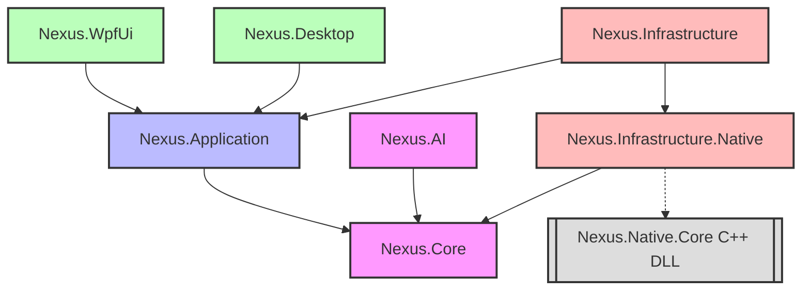

# Nexus Trading Engine - Project Dependency Graph

This document details the project dependency graph, specifying the responsibility of each assembly, allowed dependencies, forbidden dependencies, and reference paths across the workspace.

---

## 1. Visual Dependency Graph

The architecture enforces a strict hierarchical dependency graph where inner circles have zero knowledge of outer layers.



---

## 2. Permitted Dependency Matrix

The table below defines the target and permitted source references:

| Source Assembly | Target / Referenced Project | Relationship Description | Type |
| :--- | :--- | :--- | :--- |
| **Nexus.Core** | *None* | Domain Core must remain entirely independent. | - |
| **Nexus.AI** | `Nexus.Core` | References domain Core to perform inference over `MarketVector` and `Tick`. | Project Ref |
| **Nexus.Application** | `Nexus.Core` | Orchestration layer referencing Core domain models and event structures. | Project Ref |
| **Nexus.Infrastructure.Native** | `Nexus.Core` | Implements interface bindings (e.g., `INativeCoreService`) using C++ ABI. | Project Ref |
| **Nexus.Infrastructure** | `Nexus.Application`<br>`Nexus.Infrastructure.Native` | Outer infrastructure adapter implementing persistence, sockets, and worker loops. | Project Ref |
| **Nexus.Desktop** / **Nexus.WpfUi** | `Nexus.Application`<br>`Nexus.Infrastructure` | Instantiates DI containers, maps application commands, and boots UI views. | Project Ref |

---

## 3. Forbidden Dependencies

To avoid circular dependencies, tight coupling, and leaky boundaries, the following rules are strictly enforced:

```text
[Forbidden Reference] ──x──> [Target Reference]
─────────────────────────────────────────────────────────────────
1. Nexus.Core             ──x──> Nexus.Infrastructure (No database references in Core)
2. Nexus.Core             ──x──> Nexus.Application (Zero application knowledge in Core)
3. Nexus.Core             ──x──> Nexus.AI (Zero ML/Onnx dependencies in Core)
4. Nexus.Core             ──x──> Microsoft.EntityFrameworkCore (No ORMs in Core)
5. Nexus.Application      ──x──> Nexus.Infrastructure (No adapter references in Application)
6. Nexus.Application      ──x──> Nexus.Desktop/WpfUi (Zero presentation logic in Application)
7. Nexus.Application      ──x──> Microsoft.EntityFrameworkCore (Application interacts via Ports)
8. Nexus.Infrastructure   ──x──> Nexus.Desktop/WpfUi (No UI bindings in Infrastructure)
9. Nexus.Native.Core      ──x──> Any C# Assembly (C++ Core operates independently)
```

---

## 4. Project Assembly Responsibilities

### `Nexus.Core` (Domain Core)
* **Responsibility**: Houses domain logic, value objects, immutable tick structs, risk entities, and standard system ports.
* **Assembly Rules**: Zero external DLL dependencies except standard CLR libraries. No ORM references, no logging frameworks.

### `Nexus.AI` (ONNX Inference Platform)
* **Responsibility**: Provides AI models, handles ONNX feature mapping, and implements the `INeuralModelService`.
* **Assembly Rules**: Depends strictly on `Nexus.Core` and the `Microsoft.ML.OnnxRuntime` NuGet package.

### `Nexus.Application` (Workflow & Pipelines)
* **Responsibility**: Implements the execution pipeline, pre-trade risk evaluation, and background strategy supervisor logic.
* **Assembly Rules**: References only `Nexus.Core`.

### `Nexus.Infrastructure.Native` (Native Core Gateway)
* **Responsibility**: Manages P/Invoke declarations, resolves runtime shared library loading paths, and hosts safe memory handles.
* **Assembly Rules**: References only `Nexus.Core`. No references to UI or databases.

### `Nexus.Infrastructure` (Data, Network, Hosting)
* **Responsibility**: Performs persistence, schedules tasks via hosted background services, maps DB tables, and manages MT5 TCP socket connectivity.
* **Assembly Rules**: References `Nexus.Application` and `Nexus.Infrastructure.Native`. Contains third-party dependencies like EF Core, PostgreSQL, SQLite, and System.IO.Ports.

### `Nexus.Desktop` / `Nexus.WpfUi` (Operator Workstations)
* **Responsibility**: Bootstraps the application via WPF, coordinates view model bindings, and switches UI themes.
* **Assembly Rules**: References `Nexus.Application` and `Nexus.Infrastructure` (to register DI configurations during application startup).
